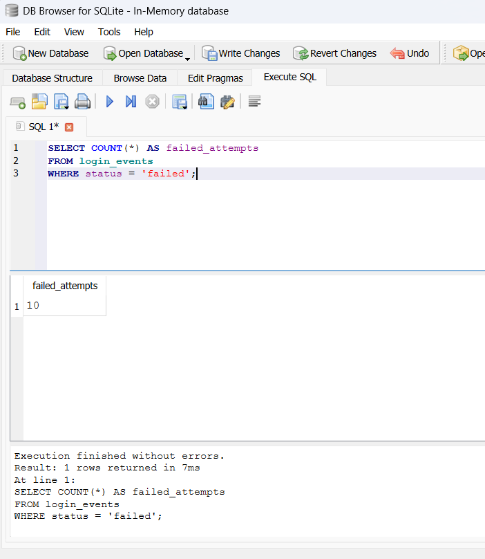
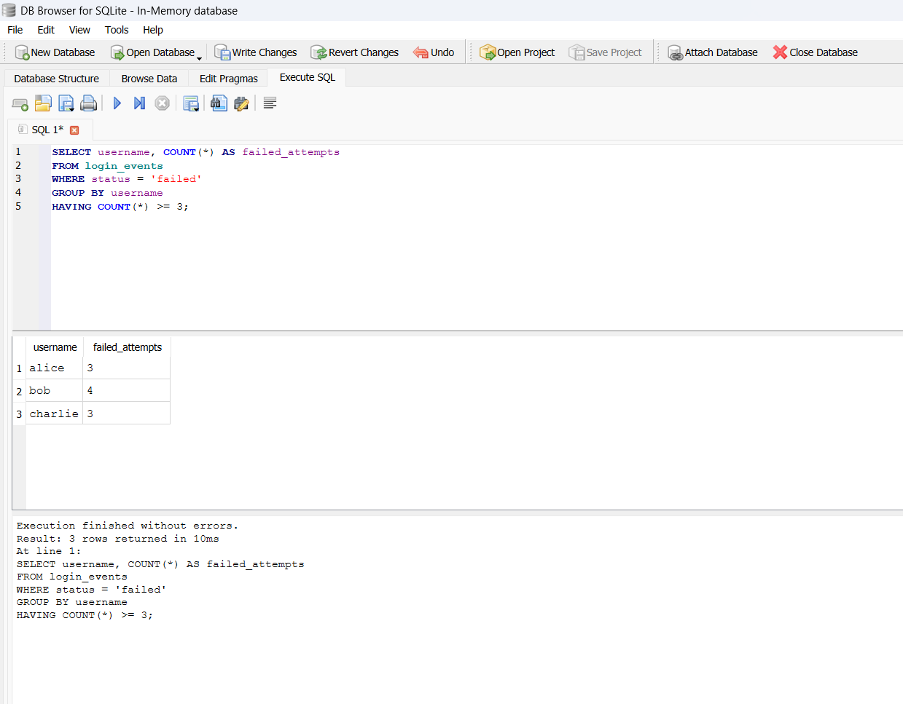
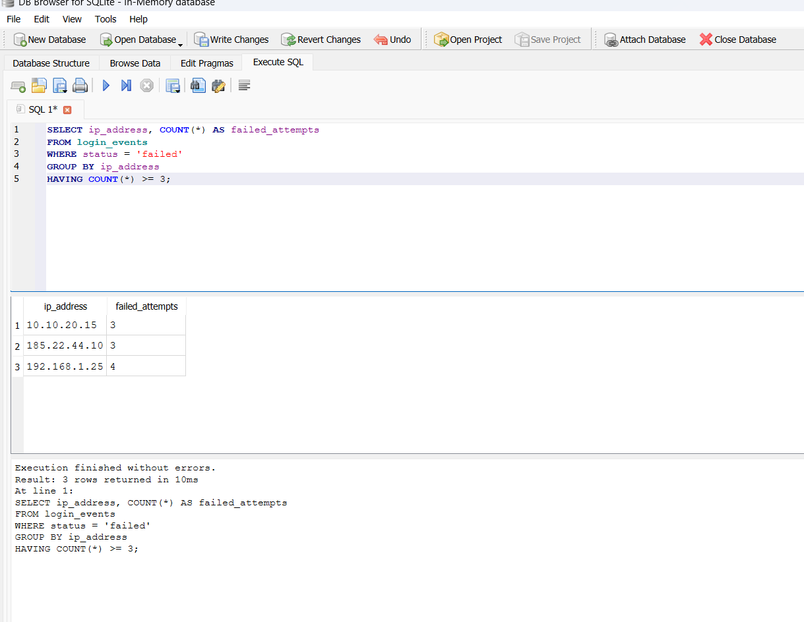
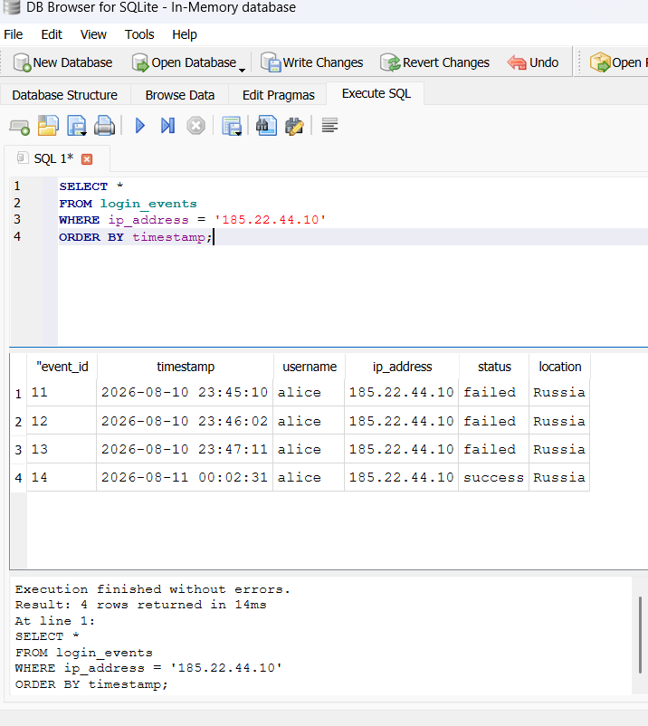

# SQL Authentication Log Investigation

## 🔎 Project Overview

This project demonstrates how SQL can be used to investigate authentication logs for potentially suspicious login activity. The investigation focuses on failed login attempts, repeated authentication failures, suspicious IP addresses, and successful logins occurring after multiple failed attempts.

The dataset used in this project is synthetic and was created for cybersecurity analysis and learning purposes.

---

## 🎯 Objective

The objective of this investigation was to analyze authentication events and identify patterns that could indicate:

* Brute-force attacks
* Password guessing
* Compromised credentials
* Suspicious login activity

The investigation also demonstrates how a security analyst can use SQL queries to support log analysis and security investigations.

---

## 🛠️ Tools & Technologies

* **SQL**
* **SQLite**
* **DB Browser for SQLite**
* **CSV**
* **GitHub**

---

## 📊 Dataset

The dataset contains authentication events with the following fields:

| Field        | Description                                  |
| ------------ | -------------------------------------------- |
| `event_id`   | Unique identifier for each event             |
| `timestamp`  | Date and time of the authentication event    |
| `username`   | Account associated with the event            |
| `ip_address` | IP address associated with the login attempt |
| `status`     | Whether the login was successful or failed   |
| `location`   | Location associated with the event           |

---

# 🔍 Investigation

## Investigation 1 — Failed Login Attempts

The first query counted the total number of failed authentication attempts.

```sql
SELECT COUNT(*) AS failed_attempts
FROM login_events
WHERE status = 'failed';
```

### Finding

The dataset contained **10 failed login attempts**.

This provides a baseline for identifying accounts and IP addresses that may require additional investigation.

### Evidence



---

## Investigation 2 — Users With Repeated Failures

The next query identified users with three or more failed authentication attempts.

```sql
SELECT username, COUNT(*) AS failed_attempts
FROM login_events
WHERE status = 'failed'
GROUP BY username
HAVING COUNT(*) >= 3;
```

### Finding

Three accounts had at least three failed authentication attempts:

* `alice` — 3 failures
* `bob` — 4 failures
* `charlie` — 3 failures

`bob` had the highest number of failed attempts in the dataset.

Repeated authentication failures can be an indicator of password guessing or other credential-based attacks, although additional evidence is required to confirm malicious activity.

### Evidence



---

## Investigation 3 — Suspicious IP Addresses

The following query identified IP addresses associated with three or more failed login attempts.

```sql
SELECT ip_address, COUNT(*) AS failed_attempts
FROM login_events
WHERE status = 'failed'
GROUP BY ip_address
HAVING COUNT(*) >= 3;
```

### Finding

The investigation identified three IP addresses with repeated failed authentication attempts:

| IP Address     | Failed Attempts |
| -------------- | --------------: |
| `10.10.20.15`  |               3 |
| `185.22.44.10` |               3 |
| `192.168.1.25` |               4 |

`192.168.1.25` generated the highest number of failed attempts.

These IP addresses should be reviewed alongside additional security logs before determining whether the activity is malicious.

### Evidence



---

## Investigation 4 — Successful Login After Failed Attempts

The following query examined activity associated with `185.22.44.10` in chronological order.

```sql
SELECT *
FROM login_events
WHERE ip_address = '185.22.44.10'
ORDER BY timestamp;
```

### Finding

The investigation identified a sequence of:

**Multiple failed login attempts → Successful login**

This pattern is potentially significant because a successful authentication occurred after several failed attempts from the same IP address.

This could indicate password guessing or compromised credentials, but the available data is not sufficient to confirm that the activity was malicious.

### Evidence



---

# 🚨 Security Analysis

Based on the available authentication logs, the following activity should be considered worthy of further investigation:

1. Multiple accounts experienced repeated failed authentication attempts.
2. `192.168.1.25` generated the highest number of failed attempts.
3. `185.22.44.10` generated multiple failed attempts against `alice`.
4. A successful login occurred from `185.22.44.10` after the failed attempts.
5. The available logs alone cannot confirm whether the activity was malicious.

---

# 🛡️ Recommendations

Based on the investigation, a security analyst could recommend:

### 1. Review the affected account

Investigate the account associated with the suspicious authentication activity and determine whether the successful login was legitimate.

### 2. Investigate the source IP

Review additional security logs, threat intelligence, and network activity associated with the suspicious IP addresses.

### 3. Enable multi-factor authentication

MFA can provide an additional layer of protection if user credentials are compromised.

### 4. Review authentication policies

Consider appropriate controls such as account lockout thresholds, rate limiting, and monitoring for repeated failed authentication attempts.

### 5. Continue monitoring

Monitor the affected accounts and IP addresses for additional suspicious authentication activity.

---

# 💻 Skills Demonstrated

This project demonstrates practical skills in:

* SQL querying
* Authentication log analysis
* Filtering and grouping security events
* Identifying repeated failed login attempts
* Investigating suspicious IP addresses
* Recognizing potential attack patterns
* Security event interpretation
* Documenting security findings
* Developing security recommendations

---

# 📁 Project Structure

```text
sql-authentication-log-investigation/
│
├── README.md
├── investigation.sql
├── login_events.csv
│
└── screenshots/
    ├── 01-failed-login-count.png
    ├── 02-repeated-login-failures.png
    ├── 03-suspicious-ip.png
    └── 04-success-after-failures.png
```

---

# 📌 Conclusion

This project demonstrates how SQL can be used as a practical security analysis tool for investigating authentication logs. By combining filtering, aggregation, grouping, and chronological analysis, suspicious login patterns can be identified for further investigation. The project also demonstrates the importance of distinguishing between suspicious activity and confirmed malicious activity. Further investigation using additional logs and security tools would be required to determine whether the identified events represent an actual security incident.
